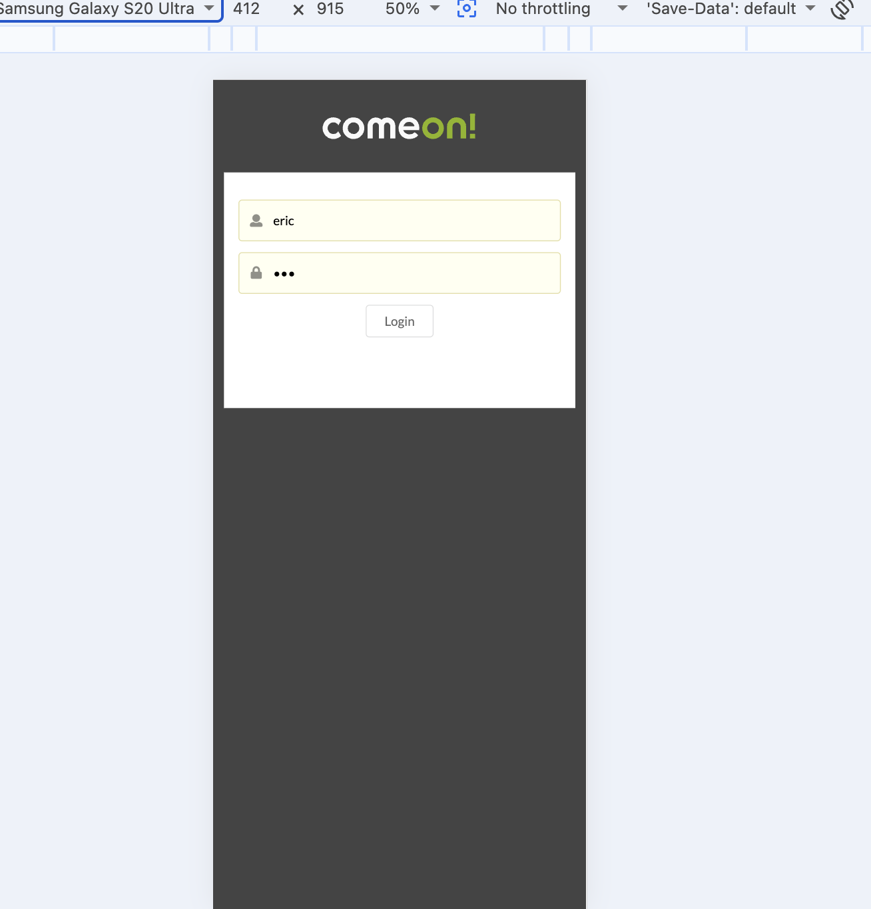
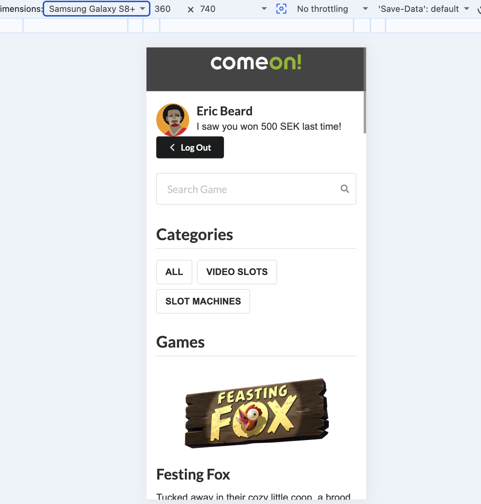
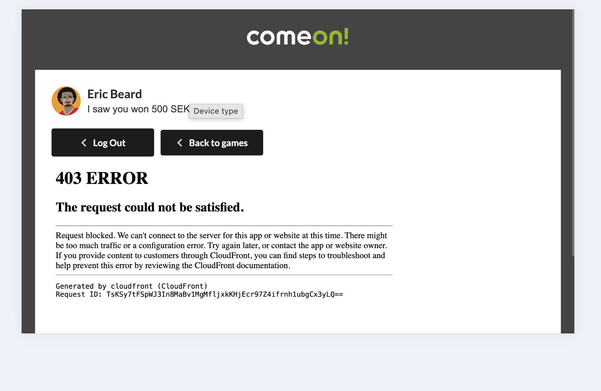

# ComeOn Frontend Assignment

A responsive casino frontend built with React and TypeScript for the ComeOn Group frontend assignment.

The application supports authentication, protected routes, game browsing, URL-based search and category filtering, and game launching through the provided ComeOn API.
## Preview

### Login

<p align="center">
  
</p>

### Games

<p align="center">
  
</p>

### Games

<p align="center">
  
</p>


<p align="center">
  
</p>

## Features

- Login using the provided mock API
- Friendly feedback for invalid credentials
- Persistent authentication using local storage
- Protected games and game routes
- Logout through the `/logout` endpoint
- Games and categories loaded from the mock API
- Search by game name or description
- Relevance-based search result ordering
- Category filtering
- Search and category state stored in URL parameters
- Loading and error states with retry
- Responsive desktop, tablet and mobile layouts
- Accessible UI with semantic HTML and ARIA attributes
- Unit and integration tests with Vitest and React Testing Library

## Technology

- React
- TypeScript
- Vite
- React Router
- Semantic UI CSS
- Vitest
- React Testing Library
- json-server

## Requirements

- Node.js `20.19+` or `22.12+`
- npm

## Installation

Clone the repository:

```bash
git clone https://github.com/SimonaElshamaa/comeon-frontend-test.git
cd comeon-frontend-test
```

Install dependencies:

```bash
npm ci
```

## Running the application

Start the mock API in one terminal:

```bash
npm run api
```

The API will run at:

```text
http://localhost:3001
```

Start the frontend in another terminal:

```bash
npm run dev
```

Open the URL displayed by Vite, normally:

```text
http://localhost:5173
```

## Test accounts

| Username | Password |
|---|---|
| `rebecka` | `secret` |
| `eric` | `dad` |
| `stoffe` | `rock` |

## Environment configuration

The application uses `http://localhost:3001` as the default API URL.

It can be changed by creating a `.env.local` file:

```env
VITE_API_BASE_URL=http://localhost:3001
```

## Available scripts

```bash
npm run dev
npm run api
npm run lint
npm run test
npm run test:run
```

- `dev` – starts the Vite development server
- `api` – starts the mock API
- `build` – type-checks and creates a production build
- `lint` – runs ESLint
- `test` – runs Vitest in watch mode
- `test:run` – runs all tests once

## Architecture

The project uses a small layered React architecture:

```text
src/
├── api/          API client and endpoint functions
├── auth/         Authentication context, storage and route protection
├── components/   Reusable UI components
├── hooks/        Data loading, filtering and reusable business logic
├── pages/        Route-level components
├── router/       Application routes
├── test/         Automated tests
└── types/        Shared TypeScript types
```

Responsibilities are separated between pages, reusable UI components, custom hooks, authentication, and API communication. This keeps components focused on rendering while custom hooks manage reusable business logic.

API functions and UI behavior are injected through function parameters and props. This keeps components less coupled and easier to test.

## API layer
All HTTP requests are centralized through a reusable API client.

The client:

- Handles network failures
- Maps HTTP errors to user-friendly messages
- Parses JSON responses
- Throws a consistent `ApiError` type

This keeps API concerns separate from UI components.


## Design decisions
### State management

The application uses React Context for authentication instead of Redux.

The project has a relatively small global state, limited to the authenticated player. React Context keeps the solution simple while avoiding the additional complexity and boilerplate of Redux.

Authentication state is persisted in local storage, allowing protected routes to remain accessible after a browser refresh until the user logs out.

### Separation of concerns

The application separates responsibilities across pages, reusable UI components, custom hooks, authentication, and the API layer.

- Pages compose features and handle routing.
- Custom hooks encapsulate reusable business logic such as data loading and filtering.
- Components focus on rendering the UI.
- API communication is centralized in a reusable client.
- Authentication is managed independently through React Context.

### Dependency injection

Custom hooks receive API functions through parameters instead of importing them directly.

This keeps the hooks loosely coupled to the API implementation and makes them easier to test by allowing mock functions to be injected during unit tests.

### URL-based filtering

Search and category values are stored in URL parameters:

```text
/games?search=fox&category=1
```

This preserves filters across refreshes and supports browser Back and Forward navigation.

### Search relevance

Matching games are ordered by relevance:

1. Exact name match
2. Name starts with the query
3. Name contains the query
4. Description contains the query

Games with the same score keep their original API order.

### Authentication persistence

The authenticated player is stored locally so protected routes continue to work after refreshing the browser. Logout removes the stored player.

## Testing

Tests are written with Vitest and React Testing Library and focus on user-visible behavior, including:

- Successful login
- Failed login feedback
- Game navigation through the Play button
- Combined search and category filtering
- API failure
- Logout behavior

Run all tests once with:

```bash
npm run test:run
```
## Accessibility

The application includes several accessibility improvements:

- Semantic HTML elements
- Accessible form labels
- Keyboard-accessible controls
- ARIA labels where appropriate
- Error messages announced using `role="alert"`
- Loading state announced using `role="status"`

## Responsive design

The interface adapts to desktop, tablet, and mobile screen sizes using responsive layouts and media queries.

## Known limitation

The provided external game launcher can return a `403` response in the test environment. The application still performs the required journey and calls:

```ts
comeon.game.launch(gameCode);
```

The game container is cleaned up when leaving the game page.

## Possible future improvements

- Server-backed session validation
- Debounced search for larger datasets
- Pagination or virtualized game lists
- More extensive accessibility testing
- End-to-end tests with Playwright
